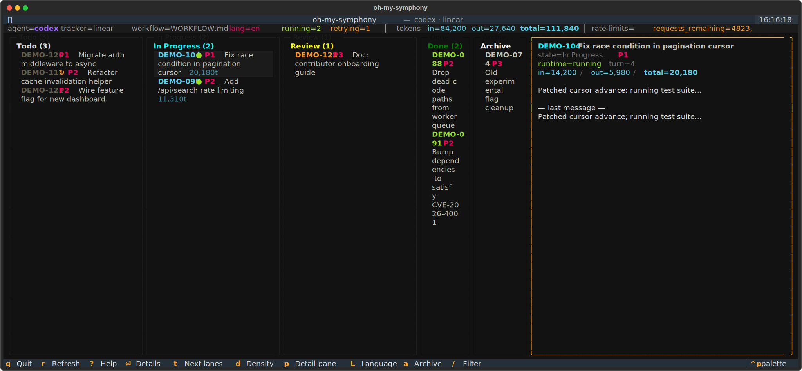

# oh-my-symphony

**English | [한국어](README.ko.md)**

[](LICENSE)
[](https://www.python.org/)
[](https://github.com/cskwork/oh-my-symphony/actions/workflows/tests.yml)
[](https://github.com/cskwork/oh-my-symphony/stargazers)

> One terminal. One Kanban board. Four AI coding agents
> (**Codex**, **Claude Code**, **Gemini**, **Pi**) — pick per ticket, run in
> parallel, watch live.



<sub>`symphony tui ./WORKFLOW.md` — columns are your tracker's states; cards show the active agent, turn count, last event, and accumulated tokens. Live indicators: ● running, ↻ retry queued, ✓ done.</sub>

**Stop juggling AI coding CLIs.** Symphony hands each Kanban ticket to the
agent you want, runs them concurrently in isolated `git worktree` workspaces,
and shows live progress — turn counts, token usage, rate-limit headroom — in
a Jira-style TUI you never have to leave your terminal for.

[**Try it in 60 seconds, no AI CLI required →**](#try-it-in-60-seconds-no-agent-cli-required)

## Why Symphony?

- **No vendor lock-in.** Swap Codex ↔ Claude Code ↔ Gemini ↔ Pi with one
  YAML line, or mix backends per ticket. New agents (Ollama, local models,
  anything with a CLI) drop in behind a thin `AgentBackend` Protocol — four
  steps, no orchestrator changes.
- **See what your agents are actually doing.** Live Kanban shows turn count,
  last event, accumulated tokens, and rate-limit headroom for every running
  card. No more "is it stuck or just thinking?" — and no SaaS dashboard to
  log into.
- **Run dozens of tickets in parallel, unattended.** Concurrency is built in:
  every ticket gets its own `git worktree` workspace, so agents can't step on
  each other. Headless mode mirrors progress to a Markdown file you can
  `tail -F` in any editor; macOS keep-awake stops the lock screen from
  killing overnight pipelines.
- **No SaaS, no API key, no signup to try.** File-based Markdown Kanban
  means tickets live in `git` next to your code. Linear is supported as a
  drop-in tracker; you don't need it.
- **Battle-tested core.** Forked from
  [OpenAI's official Symphony reference implementation](https://github.com/openai/symphony).
  The orchestrator, scheduler, retry policy, workspace lifecycle, and prompt
  renderer are all upstream — this fork is a thin layer that adds the four
  backends and the TUI.
- **A real web app, not just a viewer.** The orchestrator port serves a
  Linear-style board: register issues (with skills attached), drag cards
  between columns, add / delete / rename columns, edit each column's stage
  prompt, pick feature / merge branches, pause / resume workers, and read a
  dedicated stats page (tokens per day, cycle time per column, per-agent
  totals). All edits round-trip into `WORKFLOW.md` with your comments intact.
- **Operator-grade tooling out of the box.** `symphony doctor` catches the
  five most common first-run failures (port collisions, missing CLIs,
  placeholder URLs, unwritable workspaces, missing board directories) in one
  pass. `symphony service
  start/stop/restart/logs` runs the orchestrator as a managed background
  service.

## Who is this for?

- **Solo devs** running unattended overnight refactors across dozens of
  tickets while they sleep.
- **Teams** parallelizing bug fixes, doc updates, or migration tickets across
  multiple coding agents simultaneously.
- **Researchers and reviewers** comparing how Codex, Claude Code, Gemini, and
  Pi tackle the same task side by side, with identical prompts and
  workspaces.
- **Anyone** who hit the "one chat window per agent" ceiling and wants a
  real orchestrator with a Kanban they can read at a glance.

## How it works

<details>
<summary>Plain-text version of the TUI (for terminals viewing raw README)</summary>

```text
  agent=codex  tracker=linear  workflow=WORKFLOW.md  lang=en   running=2  retrying=1   │  tokens in=84,200 out=27,640 total=111,840
                                                                                       │  rate-limits=requests_remaining=4823, tokens_remaining=1.2M

╭── Todo (3) ──────╮ ╭── In Progress (2) ──╮ ╭── Review (1) ──╮ ╭── Done (2) ──╮ ╭── Archive (1) ──╮ ╭── detail ───────────────────────╮
│  DEMO-120  P1    │ │  DEMO-104  ●  P1    │ │  DEMO-122  P3  │ │  DEMO-088    │ │  DEMO-074       │ │  DEMO-104                       │
│  Migrate auth …  │ │  Fix race condi…    │ │  Doc: contri…  │ │  Drop dead-… │ │  Old experim…   │ │  Fix race condition in pagina…  │
│  #backend …      │ │  turn 4  20,180t    │ │  #docs         │ │  DEMO-091    │ │                 │ │                                 │
│                  │ │  Patched cursor…    │ ╰────────────────╯ │  Bump deps…  │ ╰─────────────────╯ │  state=In Progress              │
│  DEMO-111  ↻ P2  │ │                     │                    ╰──────────────╯                     │  runtime=running                │
│  Refactor cach…  │ │  DEMO-098  ●  P2    │                                                         │  turn=4                         │
│  retry #2  tur…  │ │  Add /api/sear…     │                                                         │  in=14,200  out=5,980           │
│                  │ │  turn 2  11,310t    │                                                         │  total=20,180                   │
│  DEMO-121  P2    │ │  Added token-bu…    │                                                         │  Patched cursor advance;        │
│  Wire feature …  │ ╰─────────────────────╯                                                         │  running test suite...          │
│  blocked by D…   │                                                                                 ╰─────────────────────────────────╯
╰──────────────────╯

q quit · r refresh · enter details · n new issue · s stats · 1-9 zoom lane · t/T page lanes · d density · p detail-pane · L language · a archive · c confirm done · P pause/resume · / filter · ?
```

</details>

A multi-agent fork of [OpenAI's Symphony reference implementation](https://github.com/openai/symphony).
Upstream polls a tracker (Linear or a local Markdown Kanban) and runs a Codex
session inside a per-issue workspace. This fork keeps that orchestrator and
adds:

1. A pluggable **AgentBackend** layer with four concrete adapters:
   - **Codex** — `codex app-server` (JSON-RPC stdio, multi-turn) — original
   - **Claude Code** — `claude -p --output-format stream-json --verbose`
     (NDJSON events, per-turn subprocess with `--resume`)
   - **Gemini** — `gemini -p ""` (one-shot per turn, stdin prompt → stdout result)
   - **Pi** — `pi --mode json -p ""` (JSONL events, per-turn subprocess with
     `--session` resume; supports Anthropic / OpenAI / Gemini / Bedrock backends
     under one CLI — see [pi.dev](https://pi.dev))
2. A **Jira-style CLI Kanban TUI** built on [Textual](https://textual.textualize.io).
   Columns are tracker states; cards show the active agent, turn count, last
   event, and accumulated tokens. Cards are focusable, the mouse wheel
   scrolls each lane, `enter` opens a full-detail modal, `n` registers a new
   ticket, and `s` opens the stats screen.
3. A **built-in web Kanban app** on the orchestrator port — issue CRUD with
   per-ticket skills, drag-and-drop state moves, column add/delete/rename,
   per-column prompt editing, branch policy, and a dedicated stats page.

The orchestrator, scheduler, retry policy, workspace manager, tracker layer,
and prompt renderer are unchanged from upstream — this fork is a thin layer
on top of a battle-tested orchestrator core.

## Pick an agent

Set `agent.kind` in your `WORKFLOW.md`:

```yaml
agent:
  kind: claude          # codex | claude | gemini | pi

claude:
  command: claude -p --output-format stream-json --verbose
  resume_across_turns: true
  turn_timeout_ms: 3600000

pi:
  command: pi --mode json -p ""
  resume_across_turns: true
  turn_timeout_ms: 3600000
```

Each backend reads its own block (`codex`, `claude`, `gemini`, `pi`); only the
one matching `agent.kind` is used at runtime. The Codex `linear_graphql`
client tool is only advertised when `agent.kind=codex`.

`agent.kind` is the global default. A file-board ticket can opt into a
different backend by adding ticket frontmatter:

```yaml
agent:
  kind: codex
```

The flat alias `agent_kind: codex` is also accepted for hand-edited cards.
All backend command and timeout settings still come from the matching global
`codex:`, `claude:`, `gemini:`, or `pi:` block in `WORKFLOW.md`.
When creating file-board tickets from the CLI, use
`symphony board new TASK-2 "title" --agent-kind codex`.

For file-board workflows, `agent.auto_triage_actionable_todo` defaults to
`true`: a Todo ticket with a body and an `Acceptance Criteria` section moves to
Explore with a one-line `## Triage` note without spending a model turn. Bug
tickets, blocked tickets, ambiguous tickets, and Linear trackers still use the
Todo prompt.

## Install

```bash
python3 -m venv .venv
source .venv/bin/activate
pip install -e ".[dev]"
```

Make the relevant CLI available on `$PATH`:

| `agent.kind` | required CLI on `$PATH` |
|--------------|------------------------|
| `codex`      | `codex` (with `app-server` subcommand) |
| `claude`     | `claude` (Claude Code) |
| `gemini`     | `gemini` (Gemini CLI)  |
| `pi`         | `pi` (Pi coding-agent — `npm i -g @earendil-works/pi-coding-agent` or `curl -fsSL https://pi.dev/install.sh \| sh`; sign in once via `pi` → `/login` (OAuth, credentials cached at `~/.pi/agent/auth.json`) — no env var needed) |

## Try it in 60 seconds (no agent CLI required)

Want to see the TUI move cards around before installing `codex`, `claude`,
or `gemini`? Use the bundled **mock backend** — it speaks the same JSON-RPC
protocol as Codex but does no real work, just simulates turns and emits
token-usage ticks.

```bash
git clone https://github.com/cskwork/oh-my-symphony.git
cd oh-my-symphony
python3 -m venv .venv && source .venv/bin/activate
pip install -e ".[dev]"

# WORKFLOW.md pointed at the mock backend
cat > WORKFLOW.md <<'YAML'
---
tracker: { kind: file, board_root: ./kanban,
           active_states: [Todo, "In Progress"],
           terminal_states: [Done, Cancelled, Blocked] }
polling: { interval_ms: 5000 }
workspace: { root: ~/symphony_workspaces }
hooks:
  after_create: ": noop"
  before_run:   ": noop"
  after_run:    "echo done"
agent:  { kind: codex, max_concurrent_agents: 1, max_turns: 3, max_total_turns: 60 }
codex:  { command: python -m symphony.mock_codex }
server: { port: 9999 }
---
You are picking up ticket {{ issue.identifier }}: {{ issue.title }}.
YAML

symphony board init ./kanban
symphony board new TASK-1 "smoke test"
symphony tui ./WORKFLOW.md
```

Within ~5 seconds TASK-1 grows a green ● indicator in the **Todo** column,
with a turn counter and token totals climbing. Quit with `Ctrl-C` when
you've seen enough; then proceed to the real walkthrough below.

> Cards stay in their original column under the mock — only a real agent
> would rewrite `kanban/TASK-1.md` to move the card to **Done**. The mock
> exists to prove the orchestrator → backend → workspace → hooks pipeline
> end-to-end without an LLM call.

> Tunables for the mock: `SYMPHONY_MOCK_TURN_SECONDS=12`,
> `SYMPHONY_MOCK_FAIL_EVERY_N_TURNS=3`, etc. — see `src/symphony/mock_codex.py`.

---

## Preflight — `symphony doctor`

Before launching, sanity-check your setup:

```bash
symphony doctor ./WORKFLOW.md
```

Output (one line per check):

```
PASS  server.port=9999              127.0.0.1:9999 is free
PASS  agent.kind=claude             claude → /usr/local/bin/claude
FAIL  hooks.after_create            contains placeholder 'my-org/my-repo' — every dispatch will fail with rc=128. Switch to the worktree default or replace with a real clone / `: noop`.
PASS  workspace.root=~/symphony_workspaces  exists and is writable
PASS  tracker.board_root            ./kanban (3 tickets)
```

Exit code is `0` when all checks pass, `1` if any FAIL, `2` if `WORKFLOW.md`
itself can't be loaded. The doctor catches the most common first-run
failures in one pass: port collision, missing CLI on `$PATH`, the shipped
placeholder clone URL, unwritable workspace, missing board directory.

---

## Quickstart — your first task end-to-end

This walks from a clean clone to a running ticket, using the file-based
tracker and Claude Code as the agent.

### 1. Initialize the board

```bash
symphony board init ./kanban
# → initialized board at ./kanban, sample ticket DEMO-001.md
```

Each ticket is one Markdown file with YAML frontmatter at `kanban/<ID>.md`.
The orchestrator only **reads** ticket files; the agent **writes** them when
it transitions state.

### 2. Author `WORKFLOW.md`

Use the **file-tracker** example (the other one, `WORKFLOW.example.md`,
points at Linear and needs an API key):

```bash
cp WORKFLOW.file.example.md WORKFLOW.md
```

Four blocks matter for first-run sanity:

```yaml
tracker:
  kind: file
  board_root: ./kanban
  active_states: [Todo, "In Progress"]
  terminal_states: [Done, Cancelled, Blocked]

workspace:
  root: ~/symphony_workspaces

hooks:
  # Each ticket gets its own workspace at workspace.root/<ID>.
  # The shipped default attaches it as a `git worktree` of the host repo
  # on a `symphony/<ID>` branch — host working tree stays untouched.
  # Use `: noop` instead while you experiment without a host repo.
  after_create: |
    : noop                       # ← swap for the worktree default in WORKFLOW.file.example.md
  before_run: |
    : noop                       # runs before every agent turn
  after_run: |
    echo "run finished at $(date)"

prompts:
  # Symphony sends base plus only the file for the ticket's current state.
  base: ./docs/symphony-prompts/file/base.md
  stages:
    Todo: ./docs/symphony-prompts/file/stages/todo.md
    "In Progress": ./docs/symphony-prompts/file/stages/in-progress.md
```

> ⚠ The shipped `WORKFLOW.example.md` / `WORKFLOW.file.example.md` default to
> attaching the per-ticket workspace as a **git worktree** of the host repo
> (the directory containing `WORKFLOW.md`) on a `symphony/<ID>` branch. The
> host working tree is never disturbed; merge results back with
> `git -C <host> merge symphony/<ID>` (or open a PR from that branch) when
> you're satisfied — explicit operator action, never automatic.
>
> If your code lives in a *different* remote than the WORKFLOW.md repo,
> swap the hook for `git clone <remote> .` instead. While experimenting
> without any repo, use `: noop`.

### 3. Add a ticket

```bash
symphony board new TASK-1 "Fix flaky pagination test" \
  --priority 2 \
  --labels backend,test \
  --description "tests/test_pagination.py::test_cursor_advance is flaky on CI."
# → created kanban/TASK-1.md
```

Inspect:

```bash
symphony board ls                    # all tickets
symphony board ls --state Todo       # filter by state
symphony board show TASK-1           # full body
```

### 4. Launch the TUI

```bash
symphony tui ./WORKFLOW.md
```

Within one poll tick (`polling.interval_ms`, default 30s) the orchestrator
dispatches a worker, the card grows a green ● indicator (with turn counter
and token totals), and the agent runs. On success the agent rewrites
`kanban/TASK-1.md` to set `state: Done` and append a `## Resolution`
section — that file edit is what moves the card from the **Todo** column
into **Done**. Quit with `Ctrl-C`.

> Cards are placed in columns based on the ticket file's `state` field
> (`tui.py` reads it on each tick). The green ● indicator is overlaid on
> top of the card and does **not** change which column it sits in. So a
> running ticket stays in **Todo** until the agent itself rewrites the
> file — that's by design (the orchestrator only reads ticket files; the
> agent owns writes).

> The TUI needs a real terminal (TTY). If you launch it from a script /
> background process / non-interactive shell, the process exits silently —
> always run it in a foreground terminal.

### 4b. Headless mode + `WORKFLOW-PROGRESS.md`

Drop `tui` to run the orchestrator without opening the Kanban UI:

```bash
symphony ./WORKFLOW.md                  # headless; progress mirror auto-on
symphony ./WORKFLOW.md --no-progress-md # headless; no progress file
```

A live `WORKFLOW-PROGRESS.md` is rewritten next to your workflow file on
every tick (default ~30s) and on every state change in between. Open it
in your editor to follow along without a TTY:

```markdown
# Symphony Progress
_Updated: 2026-05-16 14:22:31 UTC_

## Kanban
| State        | Tickets |
|--------------|---------|
| Todo         | OLV-005, OLV-006 |
| In Progress  | OLV-002 (8m12s · 12k tok) |
| Review       | OLV-001 |
| Done         | OLV-003, OLV-004 |

## Recent transitions
- `2026-05-16 14:22:31Z`  **OLV-002**  Todo → In Progress
- `2026-05-16 14:18:04Z`  **OLV-001**  In Progress → Review
```

Override location or limits via `WORKFLOW.md` frontmatter (or `--progress-md-path`):

```yaml
progress:
  enabled: true                     # default true; CLI --no-progress-md wins
  path: docs/STATUS.md              # default: WORKFLOW-PROGRESS.md beside WORKFLOW.md
  max_transitions: 20               # how many recent transitions to keep
```

The mirror is read-only output — Symphony rewrites the file atomically;
do not edit it by hand.

#### macOS keep-awake

While a run is active, Symphony holds a wake-lock on macOS so the screen
saver / lock screen cannot interrupt a long unattended pipeline (the
process itself is fine either way, but a locked display blocks operator
attention and many auto-suspend policies). Disable per run with
`--no-keep-awake`, or persist in `WORKFLOW.md`:

```yaml
system:
  keep_awake: false   # default true; CLI --no-keep-awake also wins
```

Non-macOS hosts log `keep_awake_skipped` and continue without a wake-lock.

#### Slack notifications (optional)

Opt in by setting a Slack incoming-webhook URL. With the block below in
`WORKFLOW.md`, Symphony posts one message per tracker state transition.
Omit the block and nothing is sent — the feature is fully off by default.

```yaml
notifications:
  slack:
    webhook_url: $SLACK_WEBHOOK_URL    # required; $VAR resolved at load time
    enabled: true                       # default true when webhook is set
    notify_on_states: []                # empty = every transition; or e.g. [Done, Blocked]
    templates:                          # optional per-state overrides
      Done: "✅ ${identifier} ${title} (${workflow})"
      Blocked: "🚧 ${identifier} blocked — ${title}"
    username: Symphony
    icon_emoji: ":robot_face:"
    timeout_ms: 5000
```

Template placeholders: `${identifier}` `${title}` `${prev_state}`
`${next_state}` `${workflow}` `${reason}`. Bad templates render the unknown
key literally — they never raise. Network errors are caught and logged
(`slack_notify_network_error`) so a Slack outage cannot block the
orchestrator's transition path.

### 5. Inspect the result

```bash
symphony board show TASK-1               # the agent's ## Resolution lives in the body
ls ~/symphony_workspaces/TASK-1          # workspace it operated in
```

Symphony writes structured logs to **stderr only**. To keep them around,
redirect at launch:

```bash
mkdir -p log
symphony tui ./WORKFLOW.md 2>> log/symphony.log
# or, while running headless:
symphony ./WORKFLOW.md --port 9999 2>&1 | tee -a log/symphony.log
```

Then `tail -F log/symphony.log` works.

### 6. Move tickets manually (rare)

```bash
symphony board mv TASK-1 Blocked         # forces a state transition
```

The orchestrator re-evaluates on the next poll tick. Manual transitions are
for unsticking — normally the agent transitions tickets itself per the
stage-specific prompt files configured by `WORKFLOW.md`.

### How dispatch works in one diagram

```
┌────────────┐    poll      ┌──────────────┐    matches active_states
│  kanban/   │  ─────────▶  │ Orchestrator │  ─────────────────────────┐
│  *.md      │   30s tick   │ (scheduler)  │                            │
└────────────┘              └──────────────┘                            ▼
      ▲                            │                          ┌──────────────────┐
      │                            │ creates workspace        │  Workspace       │
      │ agent writes               ▼                          │  ~/sym…/TASK-1   │
      │ ## Resolution     ┌──────────────────┐                │  + after_create  │
      │ + state: Done     │  AgentBackend    │  ◀────────────│    hook ran      │
      └───────────────────│  (codex/claude/  │                └──────────────────┘
                          │   gemini)        │                          │
                          │  per-turn loop   │  before_run hook ──▶ turn(s)
                          └──────────────────┘                          │
                                                                        ▼
                                                                  after_run hook
```

## Per-ticket artefacts

Every artefact a ticket produces lives under `docs/<TICKET-ID>/<stage>/`. See [`docs/PIPELINE.md`](docs/PIPELINE.md#per-ticket-artefact-root) for the layout, what to commit, and the `${LLM_WIKI_PATH:-./docs/llm-wiki}/` carve-out.

## Custom prompts

`WORKFLOW.md` can point at editable prompt files under `docs/`:

```yaml
prompts:
  base: ./docs/symphony-prompts/file/base.md
  stages:
    Todo: ./docs/symphony-prompts/file/stages/todo.md
    Explore: ./docs/symphony-prompts/file/stages/explore.md
    Plan: ./docs/symphony-prompts/file/stages/plan.md
    "In Progress": ./docs/symphony-prompts/file/stages/in-progress.md
```

Symphony sends `base` plus only the prompt file for the ticket's current
state, keeping each turn smaller than the old all-stage prompt. If the
`prompts` block is absent, the inline body of `WORKFLOW.md` still works as
the legacy fallback. Prompts are also editable in place from the web app's
**Workflow** page — same files, no restart needed.

## Skills — per-ticket instructions

Drop a skill next to `WORKFLOW.md` and attach it to any ticket:

```
skills/
└── tdd/
    └── SKILL.md      # ---\n name: tdd\n description: test first\n--- + body
```

```yaml
# kanban/TASK-7.md frontmatter
skills: [tdd]
```

When the ticket dispatches, each attached skill's body is appended to the
first-turn prompt under `## Attached skills`. Attach skills from the web
app's issue modal, the TUI `n` form, or by hand in the frontmatter — the
same ticket works identically either way. Unknown skill names are surfaced
to the agent as "not found" instead of silently dropped.

---

## Run

### Web app + JSON API

```bash
symphony ./WORKFLOW.md --port 9999
# open http://127.0.0.1:9999/
```

`/` serves the built-in web Kanban app (no build step, no signup, loopback
only). From the browser you can:

- **Board** — create / edit / delete issues, drag cards between columns,
  watch live run badges (turn count, tokens), pause / resume workers.
- **Workflow** — add / delete / rename / reorder kanban columns and edit
  each column's stage prompt. Changes write back into `WORKFLOW.md`
  frontmatter with your comments preserved; tickets in renamed or removed
  columns migrate automatically.
- **Skills** — see the `skills/<name>/SKILL.md` library; attach skills per
  ticket so their instructions ride along in that ticket's agent prompt.
- **Stats** — tokens per day, throughput, per-column dwell time, per-agent
  totals, average cycle time (from `.symphony/stats.jsonl`).
- **Settings** — branch policy (feature base / merge target) from a real
  local-branch dropdown.

JSON API endpoints:

| Method | Path                              | Purpose                                      |
|--------|-----------------------------------|----------------------------------------------|
| GET    | `/api/v1/state`                   | Snapshot — running, retrying, totals, limits |
| GET    | `/api/v1/board`                   | Columns + issues + live run info             |
| POST/PATCH/DELETE | `/api/v1/issues[...]`  | Issue CRUD (file tracker)                    |
| PUT    | `/api/v1/workflow/states`         | Column add / delete / rename / reorder       |
| GET/PUT| `/api/v1/workflow/prompts/<state>`| Read / edit a column's stage prompt          |
| GET    | `/api/v1/skills`                  | Available skills                             |
| GET    | `/api/v1/stats?days=N`            | Aggregated run statistics                    |
| POST   | `/api/v1/refresh`                 | Coalesced trigger of poll + reconcile        |
| POST   | `/api/v1/<id>/pause` `/resume`    | Hold / release a running worker              |

### CLI Kanban TUI (primary UI)

```bash
symphony tui ./WORKFLOW.md
# equivalent
symphony ./WORKFLOW.md --tui
```

#### Recommended default: TUI + JSON API together

The TUI is the primary operator view and the JSON API is the
programmatic / curl-friendly view. Run both in one process by pinning
`server.port` in `WORKFLOW.md` and launching with `--tui`
(`tools/board-viewer/` remains available as an optional in-browser
kanban, see below):

```yaml
# WORKFLOW.md
server: { port: 8765 }
```

```bash
symphony --tui ./WORKFLOW.md
# kanban renders in the terminal, JSON API listens on 127.0.0.1:8765
curl -s http://127.0.0.1:8765/api/v1/state | jq
```

Use `--port N` on the CLI to override the workflow value, or drop the
`server` block to disable the HTTP API entirely.

Columns are tracker states (`active_states` first, then `terminal_states`).
Cards display issue identifier + title, priority, labels (or blockers), and a
runtime indicator:

- **● green** — currently running, shows `turn N`, last event, accumulated tokens
- **↻ yellow** — in retry queue, shows `retry #N` and the last error
- **✓ green** — completed in this session

Key bindings (also auto-listed in the footer):

| Key                | Action                                       |
|--------------------|----------------------------------------------|
| `q`                | Quit (drains active workers cleanly)         |
| `r`                | Force a refresh + re-poll the tracker        |
| `?`                | Show all key bindings as a notification      |
| `tab` / `shift+tab`| Move focus to next / previous card or lane   |
| `j` / `↓`          | Scroll focused lane down one row             |
| `k` / `↑`          | Scroll focused lane up one row               |
| `space` / `pgdn`   | Page down                                    |
| `b` / `pgup`       | Page up                                      |
| `g` / `home`       | Jump to top                                  |
| `G` / `end`        | Jump to bottom                               |
| `1`–`9` / `0`      | Zoom that lane (others shrink) / reset zoom  |
| `t` / `T`          | Page lanes forward / back                    |
| `+` / `-`          | Grow / shrink the visible-lane window        |
| `d`                | Toggle card density (compact / full)         |
| `p`                | Toggle the detail pane                        |
| `]` / `[`          | Park focus in the detail pane / back to board|
| `L`                | Cycle TUI + doc language                      |
| `a`                | Archive the focused card                     |
| `c`                | Confirm a Done-gated card (clears manual gate)|
| `P`                | Pause / resume the focused running worker    |
| `/`                | Open the filter prompt                       |
| `enter`            | Open the focused card's full-detail modal    |
| `esc` / `q`        | Close the modal (when one is open)           |

Mouse: clicking a card focuses it, the wheel scrolls its lane.

#### Managed background service

For day-to-day operation, prefer the built-in service command over ad-hoc
shell jobs. It records the workflow it started under
`.symphony/run/<workflow-hash>.json`, so the same `WORKFLOW.md` cannot be
started again on a second port by accident:

```bash
symphony service start ./WORKFLOW.md --port 9999 --viewer-port 8765
symphony service status ./WORKFLOW.md
symphony service restart ./WORKFLOW.md
symphony service stop ./WORKFLOW.md
symphony service logs ./WORKFLOW.md
```

`service start` runs `symphony doctor` before spawning, starts the
orchestrator with Python's module runner, and starts `tools/board-viewer/`
when that folder exists. Commands are launched without a shell, so the same
path works on macOS, Linux, and Windows.

Since v0.4.7, the board viewer (default `--viewer-port 8765`) is no longer
read-only: running cards surface **Pause / Resume** buttons and the header
refresh button triggers an orchestrator `poll + reconcile`. The header also
shows real local git branch dropdowns for `agent.feature_base_branch` and
`agent.auto_merge_target_branch`, so operators can choose where new feature
branches start and where Learn merges land without editing YAML by hand.

#### One-shot launchers

For developers who don't want to remember the full `symphony tui` invocation,
the repo ships two launcher scripts that prefer `.venv/bin/symphony` over
`PATH`, run `symphony doctor` first, then open the TUI in a new terminal
window:

```bash
./tui-open.sh                     # macOS / Linux — uses iTerm or Terminal.app
./tui-open.sh path/to/WORKFLOW.md # explicit workflow path
tui-open.bat                      # Windows — uses cmd /k
```

Both scripts abort the launch if `doctor` reports a FAIL so you do not paint
the alt-screen on top of unreadable preflight output.

### File-based Kanban tracker

If you don't have Linear, use the local Markdown-file tracker (unchanged from
upstream):

```yaml
tracker:
  kind: file
  board_root: ./kanban
```

```bash
symphony board init ./kanban
symphony board new DEV-1 "Title" --priority 2
symphony tui ./WORKFLOW.md
```

## Layout

```
src/symphony/
  backends/
    __init__.py        AgentBackend Protocol + factory + normalized events
    codex.py           Codex JSON-RPC stdio backend (was upstream agent.py)
    claude_code.py     Claude Code stream-json backend
    gemini.py          Gemini one-shot backend
    pi.py              Pi --mode json backend (per-turn subprocess, --session resume)
  trackers/
    __init__.py        TrackerClient Protocol + factory
    file.py            FileBoardTracker (Markdown ticket files)
    linear.py          LinearClient (Linear GraphQL)
  cli/
    __init__.py        re-exports `main` for the `symphony` console_script
    __main__.py        keeps `python -m symphony.cli ...` working for service.py
    main.py            root dispatch + `symphony [WORKFLOW]`
    board.py           `symphony board ...` file-tracker helper
    doctor.py          `symphony doctor` WORKFLOW.md preflight checks
  utils/
    archive.py         auto-archive selector
    auto_merge.py      symphony/<ID> branch → host repo merge
    keep_awake.py      macOS caffeinate wrapper (no-op on other platforms)
    wiki_sweep.py      Learn-prompt wiki integrity sweep
  agent.py             back-compat shim re-exporting backends.* symbols
  workflow.py          typed config — adds AgentConfig.kind + Claude/Gemini/Pi configs
  orchestrator.py      scheduler; uses build_backend() + build_tracker_client() factories
  tui.py               Textual Kanban TUI (replaces server.py dashboard)
  server.py            JSON API only (HTML root removed)
  service.py           `symphony service` background lifecycle
  mock_codex.py        runnable via `python -m symphony.mock_codex` for demos/tests
tui-open.sh            cross-platform launcher (macOS / Linux): doctor preflight + open TUI in a new terminal window
tui-open.bat           Windows equivalent
```

## Tests

```bash
pytest -q
```

The test suite covers the upstream conformance suite, backend unit tests for
the factory, event normalization, Claude / Pi usage accumulation, Gemini
session synthesis, and Pi failure-reason detection, plus Textual
`Pilot`-driven smoke tests for the TUI app. Subprocess-driven integration
tests against real CLIs are intentionally not in CI — run them locally.

## Design notes

### Why four different lifecycles behind one Protocol?

- **Codex** opens one `app-server` subprocess per issue and speaks the
  current `codex app-server` JSON-RPC protocol (`initialize` + `thread/start`
  + `turn/start` + streamed `turn/completed` and `item/completed`
  notifications). Multi-turn within one process. Older `v2/initialize`-style
  releases are not supported — pin to `codex-cli ≥ 0.39` (current upstream).
- **Claude Code** has no persistent server; sessions are tracked by ID. Each
  `run_turn` spawns a fresh `claude -p` and uses `--resume <session-id>` from
  turn 2 onward.
- **Gemini CLI** is one-shot per invocation with no native session model.
  Each turn is independent; we synthesize a `gemini-<uuid>` session id so the
  orchestrator's bookkeeping stays consistent.
- **Pi** has no persistent server but auto-saves sessions to
  `~/.pi/agent/sessions/`. Each `run_turn` spawns a fresh `pi --mode json` and
  passes `--session <id>` from turn 2 onward. The session id is read from the
  first `{"type":"session"}` JSONL line; per-message `usage` is accumulated
  off `message_end` events, and `agent_end` is treated as the terminal event.
  Auth is delegated to Pi: the OAuth/API-key store at `~/.pi/agent/auth.json`
  populated by `/login` is inherited by the subprocess, so Symphony itself
  never handles credentials.

The `AgentBackend` Protocol hides these differences. The orchestrator only
sees normalized events (`session_started`, `turn_completed`, `turn_failed`,
…) and the latest usage / rate-limit snapshots.

### What the TUI does and does not do

The board is observer-only: cards move when the agent rewrites the underlying
ticket file (file tracker) or transitions the issue (Linear), never as a
direct UI action. That matches the upstream design philosophy — the
orchestrator is the source of truth and the UI is a thin reflection.

What you *can* do interactively:

- Focus any card with `tab` / `shift+tab` or by clicking it.
- Scroll a lane with the mouse wheel, `j` / `k`, or page keys.
- Open a focused card's full description in a modal with `enter`.

What is intentionally out of scope:

- **No card drag-drop.** Move tickets via `symphony board mv ID State`
  (file tracker) or in your tracker UI directly.
- **No agent-output log pane.** Agent stdout/stderr goes to the structured
  log; tail it with `tail -F log/symphony.log` in a side terminal.
- **No write actions to the tracker** beyond what the agent does itself.

## What is *not* implemented

Inherited from upstream:

- SSH worker extension — single-host only.
- Persistent retry queue across process restarts.
- Tracker adapters beyond Linear and the file-based Kanban.
- First-class tracker write APIs in the orchestrator. Ticket writes still
  happen through the agent (`linear_graphql` for Codex, direct file edits for
  the file-based Kanban).

Fork-specific gaps:

- Claude Code's mid-turn streaming usage events are read but not surfaced;
  the terminal `result` event is the source of truth for token totals.
- Gemini token usage is not reported by the CLI in stable form, so totals
  stay at zero for that backend.
- Multi-turn continuity for Gemini is not supported (no session protocol
  exists in the CLI). Each `run_turn` is independent.

## Contributing

PRs welcome. External contributions should target `dev` by default; see
[CONTRIBUTING.md](CONTRIBUTING.md) and the PR template for the full review
checklist. Before opening one:

```bash
pip install -e ".[dev]"
pytest -q          # must stay green
```

Backend adapters live under `src/symphony/backends/`. Adding a new agent
(e.g. an Ollama-driven local model) means:

1. implementing the `AgentBackend` Protocol in a new module,
2. registering it in `build_backend()` (`src/symphony/backends/__init__.py`),
3. adding a `<kind>Config` dataclass to `workflow.py` and threading it
   through `build_service_config` + `validate_for_dispatch`,
4. extending `SUPPORTED_AGENT_KINDS`.

The bar for upstreaming a backend is: passes the existing factory + event
normalization tests, doesn't bleed protocol-specific types into the
orchestrator, and ships a default `<kind>` block in `WORKFLOW.example.md`.

## Acknowledgements

This project is built on top of OpenAI's
[Symphony](https://github.com/openai/symphony) reference implementation. The
upstream Apache-2.0 licensed work provides the orchestrator, the scheduler,
and the workspace lifecycle that make this fork possible. See `NOTICE` for
attribution details.

The TUI is built on Will McGugan's [Textual](https://textual.textualize.io)
framework, with [rich](https://github.com/Textualize/rich) used directly for
text styling inside cards.

Pipeline stage rules adapt the evidence-first ideas of [cskwork/backend-dev-skills](https://github.com/cskwork/backend-dev-skills) (MIT).

## License

[Apache 2.0](LICENSE).
