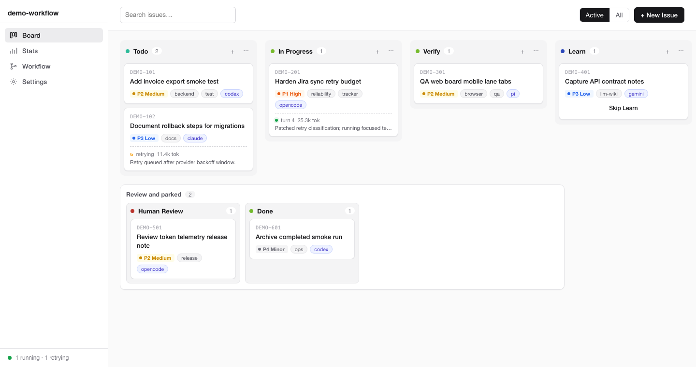
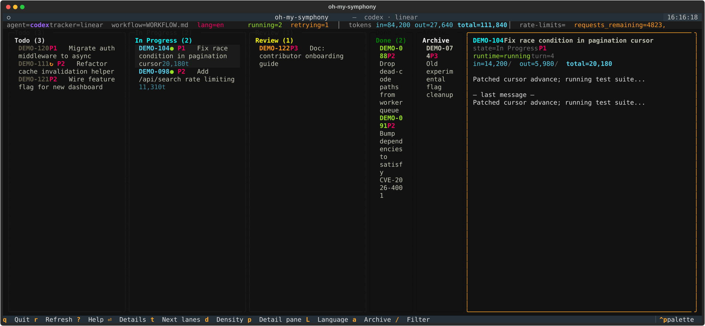

# oh-my-symphony

**English | [한국어](README.ko.md)**

[](LICENSE)
[](https://www.python.org/)
[](https://github.com/cskwork/oh-my-symphony/actions/workflows/tests.yml)
[](https://github.com/cskwork/oh-my-symphony/stargazers)

> One control plane. One terminal. Multiple project boards. Eight AI coding agents
> (**Codex**, **Claude Code**, **Gemini**, **AGY/Antigravity**, **Kiro**,
> **OpenCode**, **Pi**, **Prime Agent**) — pick per ticket, run in parallel,
> review Git changes, preview builds, and watch live.



<sub>`symphony service start ./WORKFLOW.md --port 9999` — the built-in admin UI served at `http://127.0.0.1:9999/`: switch projects; manage issues and workflows; inspect live runs, stats, and Git changes; merge, push, or open PRs; use operator chat; and launch health-checked product previews. Screenshot uses sanitized demo data.</sub>



<sub>`symphony tui ./WORKFLOW.md` — columns are your tracker's states; cards show the active agent, turn count, last event, and accumulated tokens. Live indicators: ● running, ↻ retry queued, ✓ done.</sub>

**Stop juggling AI coding CLIs.** Symphony hands each Kanban ticket to the
agent you want, runs them concurrently in isolated `git worktree` workspaces,
and shows live progress — turn counts, token usage, and rate-limit headroom
when reported by the selected CLI — in
the 9999 browser admin UI or a Jira-style TUI you never have to leave your
terminal for.

[**Try it in 60 seconds, no AI CLI required →**](#try-it-in-60-seconds-no-agent-cli-required)

## Contents

- [Why Symphony?](#why-symphony)
- [How it works](#how-it-works)
- [Pick an agent](#pick-an-agent)
- [Install](#install)
- [Try it in 60 seconds](#try-it-in-60-seconds-no-agent-cli-required)
- [Quickstart](#quickstart--your-first-task-end-to-end)
- [Lane presets](#lane-presets)
- [Chat intake](#chat-intake--type-a-request-the-board-delivers)
- [Continuous improvement](#continuous-improvement--experimental-autonomous-upkeep)
- [Run](#run)
- [Layout](#layout)
- [Tests](#tests)
- [Design notes](#design-notes)
- [What is not implemented](#what-is-not-implemented)

## Why Symphony?

- **No vendor lock-in.** Swap Codex ↔ Claude Code ↔ Gemini ↔ AGY ↔ Kiro ↔ OpenCode ↔ Pi ↔ Prime Agent with one
  YAML line, or mix backends per ticket. New agents (Ollama, local models,
  anything with a CLI) drop in behind a thin `AgentBackend` Protocol without
  changing the orchestrator.
- **See what your agents are actually doing.** Live Kanban shows turn count,
  last event, accumulated tokens, and provider-reported rate-limit headroom
  when available. No more "is it stuck or just thinking?" — and no SaaS
  dashboard to log into.
- **Run dozens of tickets in parallel, unattended.** Concurrency is built in:
  every ticket gets its own `git worktree` workspace, so agents can't step on
  each other. Headless mode mirrors progress to a Markdown file you can
  `tail -F` in any editor; macOS keep-awake stops the lock screen from
  killing overnight pipelines.
- **No SaaS, no API key, no signup to try.** File-based Markdown Kanban
  means tickets live in `git` next to your code. Linear and Jira are supported
  external trackers; you don't need either one to try Symphony.
- **Battle-tested base, hardened for local operations.** Forked from
  [OpenAI's official Symphony reference implementation](https://github.com/openai/symphony).
  This fork keeps the file-first orchestration model, then adds eight agent
  backends, the TUI/web operator surfaces, SQLite run leases, restart-safe
  issue flags, and locked Markdown ticket writes.
- **A real web app, not just a viewer.** The orchestrator port serves a
  multi-project control plane: issue CRUD, drag-and-drop columns, per-column
  stage prompts, branch policy, pause / resume, lane presets, operator chat,
  stats, integrated Git review and delivery, and health-checked product
  previews. Workflow edits round-trip into `WORKFLOW.md` with comments intact.
- **Operator-grade tooling out of the box.** `symphony doctor` catches the
  five most common first-run failures (port collisions, missing CLIs,
  placeholder URLs, unwritable workspaces, missing board directories) in one
  pass. `symphony service
  start/stop/restart/logs` runs the orchestrator as a managed background
  service.

## Who is this for?

- **Solo devs** running unattended overnight refactors across dozens of
  tickets while they sleep.
- **Teams** parallelizing bug fixes, doc updates, or migration tickets across
  multiple coding agents simultaneously.
- **Researchers and reviewers** comparing how Codex, Claude Code, Gemini,
  AGY/Antigravity, Kiro, OpenCode, Pi, and Prime Agent tackle the same task side by side,
  with identical prompts and workspaces.
- **Anyone** who hit the "one chat window per agent" ceiling and wants a
  real orchestrator with a Kanban they can read at a glance.

## How it works

<details>
<summary>Plain-text version of the TUI (for terminals viewing raw README)</summary>

```text
  agent=codex  tracker=linear  workflow=WORKFLOW.md  lang=en   running=2  retrying=1   │  tokens in=84,200 out=27,640 total=111,840
                                                                                       │  rate-limits=requests_remaining=4823, tokens_remaining=1.2M

╭── Todo [1/4] (3) ╮ ╭── In Progress [2/4] ╮ ╭── Verify [3/4] ╮ ╭── Document [4/4] ╮ ╭── Done (2) ──╮ ╭── detail ───────────────────────╮
│  DEMO-120 [1/4]  │ │  DEMO-104 [2/4] ●   │ │  DEMO-122 [3/4]│ │  DEMO-123     │ │  DEMO-088    │ │  DEMO-104 [2/4]                 │
│  Migrate auth …  │ │  Fix race condi…    │ │  Review + QA   │ │  S skip       │ │  Drop dead-… │ │  Fix race condition in pagina…  │
│  #backend …      │ │  turn 4  20,180t    │ │  #docs         │ │  Wiki notes   │ │  DEMO-091    │ │                                 │
│                  │ │  Patched cursor…    │ ╰────────────────╯ ╰───────────────╯ │  Bump deps…  │ │  state=In Progress              │
│  DEMO-111  ↻ P2  │ │                     │                    ╰──────────────╯                     │  runtime=running                │
│  Refactor cach…  │ │  DEMO-098  ●  P2    │                                                         │  turn=4                         │
│  retry #2  tur…  │ │  Add /api/sear…     │                                                         │  in=14,200  out=5,980           │
│                  │ │  turn 2  11,310t    │                                                         │  total=20,180                   │
│  DEMO-121  P2    │ │  Added token-bu…    │                                                         │  Patched cursor advance;        │
│  Wire feature …  │ ╰─────────────────────╯                                                         │  running test suite...          │
│  blocked by D…   │                                                                                 ╰─────────────────────────────────╯
╰──────────────────╯

q quit · r refresh · enter details · n new · e edit · s stats · S skip Document · P pause/resume · / filter · ?
```

</details>

A multi-agent fork of [OpenAI's Symphony reference implementation](https://github.com/openai/symphony).
Upstream polls a tracker (Linear or a local Markdown Kanban) and runs a Codex
session inside a per-issue workspace. This fork keeps that orchestrator and
adds:

1. A pluggable **AgentBackend** layer with eight concrete adapters:
   - **Codex** — `codex app-server` (JSON-RPC stdio, multi-turn) — original
   - **Claude Code** — `claude -p --output-format stream-json --verbose`
     (NDJSON events, per-turn subprocess with `--resume`)
   - **Gemini** — `gemini -p ""` (one-shot per turn, stdin prompt → stdout result)
   - **AGY / Antigravity** — `agy --print "$(cat)"` (one-shot per turn, stdin prompt
     -> stdout result; `agent.kind: antigravity` aliases to `agy`)
   - **Kiro** — `kiro-cli chat --no-interactive --trust-all-tools ...`
     (headless chat mode; prompt bridged into the chat input argument,
     accepts `KIRO_API_KEY` or `kiro-cli login`)
   - **OpenCode** — `opencode run --format json --auto` (one-shot per turn,
     prompt passed as the documented `message` argument; `--session` resume
     after OpenCode reports a session id)
   - **Pi** — `pi --mode json -p ""` (JSONL events, per-turn subprocess with
     `--session` resume; supports Anthropic / OpenAI / Gemini / Bedrock backends
     under one CLI — see [pi.dev](https://pi.dev))
   - **Prime Agent** — `prime-agent -p --mode json` (same JSONL protocol as Pi,
     per-turn subprocess with `--resume` continuity; supports subscriptions and
     provider API keys — see [Prime Agent](https://github.com/cskwork/prime-agent))
2. A **Jira-style CLI Kanban TUI** built on [Textual](https://textual.textualize.io).
   Columns are tracker states; cards show the active agent, turn count, last
   event, and accumulated tokens. Cards are focusable, the mouse wheel
   scrolls each lane, `enter` opens a full-detail modal, `n` registers a new
   ticket with a multiline body, `e` edits the focused ticket, `S` skips Document,
   and `s` opens the stats screen.
3. A **built-in web Kanban app** on the orchestrator port — issue CRUD with
   drag-and-drop state moves, Document skip, column add/delete/rename, per-column
   prompt editing, branch policy, and a dedicated stats page.
4. A **single-node reliability ledger** in `.symphony/state.db` — active run
   leases block duplicate dispatch across restarts, dead-owner processes are
   fenced and reaped, and the next Run attempt can resume from the latest
   completed-turn checkpoint. Retry / pause / budget-exhausted flags also
   survive process exit.

The architecture is still intentionally local and file-first: Markdown tickets
remain the human source of truth, while SQLite stores runtime coordination
state that should not be hand-edited.

## Pick an agent

Set `agent.kind` in your `WORKFLOW.md`:

```yaml
agent:
  kind: claude          # codex | claude | gemini | agy | kiro | opencode | pi | prime-agent

claude:
  command: claude -p --output-format stream-json --verbose
  resume_across_turns: true
  turn_timeout_ms: 3600000

pi:
  command: pi --mode json -p ""
  resume_across_turns: true
  turn_timeout_ms: 3600000

prime_agent:
  command: prime-agent -p --mode json
  resume_across_turns: true
  turn_timeout_ms: 3600000
```

Each backend reads its own block (`codex`, `claude`, `gemini`, `agy`, `kiro`,
`opencode`, `pi`, `prime_agent`); only the one matching `agent.kind` is used at runtime. The
Codex `linear_graphql`
client tool is only advertised when `agent.kind=codex`.

`agent.kind` is the global default. A file-board ticket can opt into a
different backend by adding ticket frontmatter:

```yaml
agent:
  kind: codex
```

The flat alias `agent_kind: codex` is also accepted for hand-edited cards.
All backend command and timeout settings still come from the matching global
`codex:`, `claude:`, `gemini:`, `agy:`, `kiro:`, `opencode:`, `pi:`, or
`prime_agent:` block
in `WORKFLOW.md`.
When creating file-board tickets from the CLI, use
`symphony board new TASK-2 "title" --agent-kind codex`.

Between the ticket pin and the global default sits optional per-state routing:
`agent.stage_kinds` maps board states to agent kinds so cheap/fast agents can
own light lanes (e.g. `Todo: gemini`, `Document: gemini`) while a strong default
handles Plan/Build/Review. Resolution per dispatch: ticket `agent_kind` pin >
`agent.stage_kinds[state]` > `agent.kind`. The backend is re-resolved at every
stage change, including the in-run lane transitions a single dispatch walks, so
a ticket that goes In Progress → Verify → Document inside one dispatch gets each
lane's configured backend.

### Heavy stages

A lane that runs a full test suite or a long build goes quiet for minutes at a
time. The stall detector cancels a worker that produced no progress event
within its backend's `stall_timeout_ms`; widening that value widens it for
every lane. `agent.stall_timeout_ms_by_state` widens just the heavy lanes:

```yaml
agent:
  stall_timeout_ms_by_state:
    Verify: 900000     # 15 min of silence is normal while the suite runs
```

The budget is resolved against the backend the ticket actually runs on (its
`agent_kind` pin or its `stage_kinds` route), not the workflow default, so
raising `claude.stall_timeout_ms` now takes effect for claude-pinned tickets on
a codex-default board.

For file-board workflows, `agent.auto_triage_actionable_todo` defaults to
`true`: a Todo ticket with a body and an `Acceptance Criteria` section moves to
In Progress with a one-line `## Triage` note without spending a model turn. Bug
tickets, blocked tickets, ambiguous tickets, and Linear trackers still use the
Todo prompt.

## Install

```bash
python3 -m venv .venv
source .venv/bin/activate
python -m pip install -e ".[dev]"
```

Make the relevant CLI available on `$PATH`:

| `agent.kind` | required CLI on `$PATH` |
|--------------|------------------------|
| `codex`      | `codex` (with `app-server` subcommand) |
| `claude`     | `claude` (Claude Code) |
| `gemini`     | `gemini` (Gemini CLI)  |
| `agy`        | `agy` (Antigravity CLI — install from Google Antigravity; Symphony appends `--dangerously-skip-permissions`) |
| `kiro`       | `kiro-cli` (Kiro CLI — install from `https://cli.kiro.dev/install`; run `kiro-cli login` or set `KIRO_API_KEY` for headless runs) |
| `opencode`   | `opencode` (OpenCode CLI — install with `npm install -g opencode-ai`; authenticate providers with `opencode auth login`) |
| `pi`         | `pi` (Pi coding-agent — `npm i -g @earendil-works/pi-coding-agent` or `curl -fsSL https://pi.dev/install.sh \| sh`; sign in once via `pi` → `/login` (OAuth, credentials cached at `~/.pi/agent/auth.json`) — no env var needed) |
| `prime-agent` | `prime-agent` (Prime Agent — install with `curl -fsSL https://app.primeintellect.ai/prime-agent/install.sh \| sh`; sign in once via `prime-agent` → `/login`, or provide a provider API key; credentials cached at `~/.prime/agent/auth.json`) |

## Create or register a project

Keep this `oh-my-symphony` checkout as the control plane. Doctor and normal
startup refuse a `WORKFLOW.md` in Symphony's own canonical Git repository
(including linked worktrees), preventing agents from editing the orchestrator
that launched them.

```bash
symphony project create "My App" --path ../my-app
# or adopt an existing directory; Git and missing Symphony files are added safely
symphony project add /path/to/existing-project --name "My App"
symphony project start my-app
symphony hub
```

The Hub and every project board show the canonical repository, workflow, and
"Issues are stored here" board paths. Use **Manage projects** to enter a name
and local path. A missing path becomes a new Git repository; an existing
non-Git directory is initialized in place; and an existing Git repository keeps
its metadata and files. Symphony adds only missing operator files and never
stages unrelated changes.

Selecting another project starts its service when needed and navigates to that
independent board. Services and workers for the previous project keep running
against their original repository, so project switching cannot retarget active
jobs.

> **Existing non-Git directories:** Symphony initializes Git and commits only
> the Symphony files it adds. Existing product files remain untracked to avoid
> accidentally committing secrets or local artifacts. Review and commit those
> files before dispatching tickets so worker worktrees include them.

## Try it in 60 seconds (no agent CLI required)

Want to see the TUI move cards around before installing an agent CLI? Use
the bundled **mock backend** — it speaks the same JSON-RPC protocol as
Codex but does no real work, just simulates turns and emits token-usage
ticks.

```bash
git clone https://github.com/cskwork/oh-my-symphony.git
cd oh-my-symphony
python3 -m venv .venv && source .venv/bin/activate
python -m pip install -e ".[dev]"

# Keep the source checkout protected; create the demo as a separate project.
symphony project create "Symphony Demo" --path ../symphony-demo
cd ../symphony-demo

# WORKFLOW.md pointed at the mock backend
cat > WORKFLOW.md <<'YAML'
---
tracker: { kind: file, board_root: ./kanban,
           active_states: [Todo, "In Progress", Verify, Document],
           terminal_states: ["Human Review", Done, Blocked, Archive] }
polling: { interval_ms: 5000 }
workspace: { root: ~/symphony_workspaces }
hooks:
  after_create: ": noop"
  before_run:   ": noop"
  after_run:    "echo done"
agent:  { kind: codex, max_concurrent_agents: 1, max_turns: 4, max_total_turns: 60 }
codex:  { command: python -m symphony.mock_codex }
server: { port: 9999 }
---
You are picking up ticket {{ issue.identifier }}: {{ issue.title }}.
YAML

symphony board init ./kanban
symphony board new TASK-1 "smoke test"
symphony tui ./WORKFLOW.md
```

Within ~5 seconds TASK-1 grows a green ● indicator in the **Todo** column,
with a turn counter and token totals climbing. Quit with `Ctrl-C` when
you've seen enough; then proceed to the real walkthrough below.

> Cards stay in their original column under the mock — only a real agent
> would rewrite `kanban/TASK-1.md` to move the card to **Done**. The mock
> exists to prove the orchestrator → backend → workspace → hooks pipeline
> end-to-end without an LLM call.

> Tunables for the mock: `SYMPHONY_MOCK_TURN_SECONDS=12`,
> `SYMPHONY_MOCK_FAIL_EVERY_N_TURNS=3`, etc. — see `src/symphony/mock_codex.py`.

---

## Preflight — `symphony doctor`

Before launching, sanity-check your setup:

```bash
symphony doctor ./WORKFLOW.md
```

Output (one line per check):

```
PASS  server.port=9999              127.0.0.1:9999 is free
PASS  agent.kind=claude             claude → /usr/local/bin/claude
FAIL  hooks.after_create            contains placeholder 'my-org/my-repo' — every dispatch will fail with rc=128. Switch to the worktree default or replace with a real clone / `: noop`.
PASS  workspace.root=~/symphony_workspaces  exists and is writable
PASS  tracker.board_root            ./kanban (3 tickets)
```

Exit code is `0` when all checks pass, `1` if any FAIL, `2` if `WORKFLOW.md`
itself can't be loaded. The doctor catches the most common first-run
failures in one pass: port collision, missing CLI on `$PATH`, the shipped
placeholder clone URL, unwritable workspace, missing board directory.

## Prove It Works

After `doctor` passes, prove the same workflow through the runtime surfaces:

```bash
symphony ./WORKFLOW.md --port 9999
curl -s http://127.0.0.1:9999/api/v1/health
symphony runs ./WORKFLOW.md --limit 5
python scripts/smoke_web_api.py --base-url http://127.0.0.1:9999
```

`/api/v1/health` reports `starting`, `ok`, or `degraded`; `symphony runs`
prints recent registry attempts; the smoke script checks health, state,
board, static assets, issue CRUD, refresh, workflow, and stats.

---

## Quickstart — your first task end-to-end

This walks from a registered project repository to a running ticket, using
the file-based tracker and Claude Code as the agent. Do not perform these steps
in the protected `oh-my-symphony` source checkout; use `symphony project create`
or `symphony project add` first.

### 1. Initialize the board

```bash
symphony board init ./kanban
# → initialized board at ./kanban, sample ticket DEMO-001.md
```

Each ticket is one Markdown file with YAML frontmatter at `kanban/<ID>.md`.
The orchestrator only **reads** ticket files; the agent **writes** them when
it transitions state.

### 2. Author `WORKFLOW.md`

Use the **file-tracker** example (the other one, `WORKFLOW.example.md`,
points at Linear and needs an API key):

```bash
cp WORKFLOW.file.example.md WORKFLOW.md
```

Four blocks matter for first-run sanity:

```yaml
tracker:
  kind: file
  board_root: ./kanban
  active_states: [Todo, "In Progress", Verify, Document]
  terminal_states: ["Human Review", Done, Blocked, Archive]

workspace:
  root: ~/symphony_workspaces

hooks:
  # Each ticket gets its own workspace at workspace.root/<ID>.
  # The shipped default attaches it as a `git worktree` of the host repo
  # on a `symphony/<ID>` branch — host working tree stays untouched.
  # Use `: noop` instead while you experiment without a host repo.
  after_create: |
    : noop                       # ← swap for the worktree default in WORKFLOW.file.example.md
  before_run: |
    : noop                       # runs before every agent turn
  after_run: |
    echo "run finished at $(date)"

prompts:
  # Symphony sends base plus only the file for the ticket's current state.
  base: ./docs/symphony-prompts/file/base.md
  stages:
    Todo: ./docs/symphony-prompts/file/stages/todo.md
    "In Progress": ./docs/symphony-prompts/file/stages/in-progress.md
    Verify: ./docs/symphony-prompts/file/stages/verify.md
    Document: ./docs/symphony-prompts/file/stages/document.md
    Done: ./docs/symphony-prompts/file/stages/done.md
```

> ⚠ The shipped `WORKFLOW.example.md` / `WORKFLOW.file.example.md` default to
> attaching the per-ticket workspace as a **git worktree** of the host repo
> (the directory containing `WORKFLOW.md`) on a `symphony/<ID>` branch. The
> host working tree is never disturbed; merge results back with
> `git -C <host> merge symphony/<ID>` (or open a PR from that branch) when
> you're satisfied — explicit operator action, never automatic.
>
> If your code lives in a *different* remote than the WORKFLOW.md repo,
> swap the hook for `git clone <remote> .` instead. While experimenting
> without any repo, use `: noop`.

### 3. Add a ticket

```bash
symphony board new TASK-1 "Fix flaky pagination test" \
  --priority 2 \
  --labels backend,test \
  --description "tests/test_pagination.py::test_cursor_advance is flaky on CI."
# → created kanban/TASK-1.md

# Structured creation: dependencies, request grouping, body from file/stdin.
symphony board new TASK-2 "Add regression test" \
  --blocked-by TASK-1 \
  --request REQ-1 \
  --label test --label ci \
  --description-file ./spec.md      # or `-` to read stdin
```

`new` validates before writing: the identifier must match
`^[A-Za-z][A-Za-z0-9_-]{0,63}$` (so a model-generated id can never escape the
board root), a state from `tracker.active_states`/`terminal_states`, every
`--blocked-by` target must exist on the board, and the added edges must keep
the dependency graph acyclic (violations print the cycle path and exit
non-zero). The web API's issue create/update endpoints apply the same rules.

Edit an existing ticket through the same validation instead of hand-writing
frontmatter:

```bash
symphony board update TASK-2 --add-blocked-by BUG-7   # keeps existing blockers
symphony board update TASK-2 --blocked-by TASK-1      # replaces the list
symphony board update BUILD-1 --state Build           # reopen a slice
symphony board update TASK-2 --request REQ-2
```

Inspect:

```bash
symphony board ls                    # all tickets
symphony board ls --state Todo       # filter by state
symphony board show TASK-1           # full body
symphony board graph                 # dependency DAG (topological, indented)
symphony board graph --request REQ-1 # only one request group
```

### 4. Launch the TUI

```bash
symphony tui ./WORKFLOW.md
```

Within one poll tick (`polling.interval_ms`, default 30s) the orchestrator
dispatches a worker, the card grows a green ● indicator (with turn counter
and token totals), and the agent runs. On success the agent rewrites
`kanban/TASK-1.md` to set `state: Done` and append a `## Resolution`
section — that file edit is what moves the card from the **Todo** column
into **Done**. Quit with `Ctrl-C`.

> Cards are placed in columns based on the ticket file's `state` field
> (`tui.py` reads it on each tick). The green ● indicator is overlaid on
> top of the card and does **not** change which column it sits in. So a
> running ticket stays in **Todo** until the agent itself rewrites the
> file — that's by design (the orchestrator only reads ticket files; the
> agent owns writes).

> The TUI needs a real terminal (TTY). If you launch it from a script /
> background process / non-interactive shell, the process exits silently —
> always run it in a foreground terminal.

### 4b. Headless mode + `WORKFLOW-PROGRESS.md`

Drop `tui` to run the orchestrator without opening the Kanban UI:

```bash
symphony ./WORKFLOW.md                  # headless; progress mirror auto-on
symphony ./WORKFLOW.md --no-progress-md # headless; no progress file
```

A live `WORKFLOW-PROGRESS.md` is rewritten next to your workflow file on
every tick (default ~30s) and on every state change in between. Open it
in your editor to follow along without a TTY:

```markdown
# Symphony Progress
_Updated: 2026-05-16 14:22:31 UTC_

## Kanban
| State        | Tickets |
|--------------|---------|
| Todo         | OLV-005, OLV-006 |
| In Progress  | OLV-002 (8m12s · 12k tok) |
| Verify       | OLV-001 |
| Done         | OLV-003, OLV-004 |

## Recent transitions
- `2026-05-16 14:22:31Z`  **OLV-002**  Todo → In Progress
- `2026-05-16 14:18:04Z`  **OLV-001**  In Progress → Verify
```

Override location or limits via `WORKFLOW.md` frontmatter (or `--progress-md-path`):

```yaml
progress:
  enabled: true                     # default true; CLI --no-progress-md wins
  path: docs/STATUS.md              # default: WORKFLOW-PROGRESS.md beside WORKFLOW.md
  max_transitions: 20               # how many recent transitions to keep
```

The mirror is read-only output — Symphony rewrites the file atomically;
do not edit it by hand.

#### macOS keep-awake

While a run is active, Symphony holds a wake-lock on macOS so the screen
saver / lock screen cannot interrupt a long unattended pipeline (the
process itself is fine either way, but a locked display blocks operator
attention and many auto-suspend policies). Disable per run with
`--no-keep-awake`, or persist in `WORKFLOW.md`:

```yaml
system:
  keep_awake: false   # default true; CLI --no-keep-awake also wins
```

Non-macOS hosts log `keep_awake_skipped` and continue without a wake-lock.

#### Slack notifications (optional)

Opt in by setting a Slack incoming-webhook URL. With the block below in
`WORKFLOW.md`, Symphony posts one message per tracker state transition.
Omit the block and nothing is sent — the feature is fully off by default.

```yaml
notifications:
  slack:
    webhook_url: $SLACK_WEBHOOK_URL    # required; $VAR resolved at load time
    enabled: true                       # default true when webhook is set
    notify_on_states: []                # empty = every transition; or e.g. [Done, Blocked]
    templates:                          # optional per-state overrides
      Done: "✅ ${identifier} ${title} (${workflow})"
      Blocked: "🚧 ${identifier} blocked — ${title}"
    username: Symphony
    icon_emoji: ":robot_face:"
    timeout_ms: 5000
```

Template placeholders: `${identifier}` `${title}` `${prev_state}`
`${next_state}` `${workflow}` `${reason}`. Bad templates render the unknown
key literally — they never raise. Network errors are caught and logged
(`slack_notify_network_error`) so a Slack outage cannot block the
orchestrator's transition path.

### 5. Inspect the result

```bash
symphony board show TASK-1               # the agent's ## Resolution lives in the body
ls ~/symphony_workspaces/TASK-1          # workspace it operated in
```

Symphony writes structured logs to **stderr only**. To keep them around,
redirect at launch:

```bash
mkdir -p log
symphony tui ./WORKFLOW.md 2>> log/symphony.log
# or, while running headless:
symphony ./WORKFLOW.md --port 9999 2>&1 | tee -a log/symphony.log
```

Then `tail -F log/symphony.log` works.

### 6. Move tickets manually (rare)

```bash
symphony board mv TASK-1 Blocked         # forces a state transition
symphony board update TASK-1 --state Blocked --add-blocked-by BUG-7
```

The orchestrator re-evaluates on the next poll tick. Manual transitions are
for unsticking — normally the agent transitions tickets itself per the
stage-specific prompt files configured by `WORKFLOW.md`.

### How dispatch works in one diagram

```
┌────────────┐    poll      ┌──────────────┐    matches active_states
│  kanban/   │  ─────────▶  │ Orchestrator │  ─────────────────────────┐
│  *.md      │   30s tick   │ (scheduler)  │                            │
└────────────┘              └──────────────┘                            ▼
      ▲                            │                          ┌──────────────────┐
      │                            │ creates workspace        │  Workspace       │
      │ agent writes               ▼                          │  ~/sym…/TASK-1   │
      │ ## Resolution     ┌──────────────────┐                │  + after_create  │
      │ + state: Done     │  AgentBackend    │  ◀────────────│    hook ran      │
      └───────────────────│  (codex/claude/  │                └──────────────────┘
                          │   gemini/open-   │                          │
                          │   code/pi)       │                          │
                          │  per-turn loop   │  before_run hook ──▶ turn(s)
                          └──────────────────┘                          │
                                                                        ▼
                                                                  after_run hook
```

## Per-ticket artefacts

Every artefact a ticket produces lives under `docs/<TICKET-ID>/<stage>/`. See [`docs/PIPELINE.md`](docs/PIPELINE.md#per-ticket-artefact-root) for the layout, what to commit, and the `${LLM_WIKI_PATH:-./docs/llm-wiki}/` carve-out.

### Board deliverables

Those `docs/` artefacts are committed evidence. Files a reviewer just wants to
*open* — screenshots, exported reports, PDFs — go somewhere else: an agent saves
them to `.symphony-artifacts/` at its workspace root, and after each turn
Symphony copies new files to `.symphony/artifacts/<TICKET-ID>/` on the host.
They then show up in the ticket drawer on the web board (images preview inline)
and as an `## Artifacts` list on the ticket itself, and they survive the
workspace being removed at Done. The directory is kept out of Git, so
deliverables never land in the merge.

An optional `.symphony-artifacts/manifest.json` adds titles:

```json
{ "artifacts": [{ "file": "login.png", "title": "Login page", "summary": "After the fix" }] }
```

Defaults, all optional in `WORKFLOW.md`:

```yaml
artifacts:
  enabled: true                 # false turns collection off entirely
  dir: .symphony-artifacts      # workspace directory agents write into
  max_file_mb: 25
  max_ticket_mb: 200
  ttl_days: 30                  # drop artifacts 30 days after a ticket is archived; 0 disables
  require_for_done: false       # true blocks Done until a ticket has at least one artifact
```

### Machine gate for application releases

Production application delivery is opt-in. Add `app-release` to the Verify
ticket, add `app-release-finalizer` to the delivery ticket named by the
contract, and commit `release-contract.yaml` at the project root. Symphony
then resolves the configured target branch on the host, requires the workspace
contract bytes to exactly match `release-contract.yaml` at that commit, and
checks every declared runner source against both the target blob and workspace
hash on every forward Verify transition, even when `agent.stage_contracts` is
off. Non-app tickets keep the v0.19.0 behavior.

```yaml
schema_version: 1
target_branch: main
finalizer_ticket: DELIVER-1
implementation_tickets: [BUILD-1, BUILD-2]
launch:
  command: npm run dev
  ready_url: http://127.0.0.1:3000
runner:
  command: npm run release:qa
  sources:
    - path: tools/release-runner.mjs
      sha256: <64 lowercase hex>
viewports:
  desktop: {width: 1440, height: 900}
  tablet: {width: 768, height: 1024}
  mobile: {width: 390, height: 844}
checks:
  - {id: feature.primary-flow, kind: feature, description: Primary flow works, repair_group: workflow, required_viewports: [desktop, mobile]}
  - {id: control.navigation, kind: control, description: Every navigation control works, repair_group: navigation, required_viewports: [desktop, mobile]}
  - {id: visual.layout, kind: visual, description: Layout matches the product brief, repair_group: presentation, required_viewports: [desktop, tablet, mobile]}
  - {id: responsive.no-clipping, kind: responsive, description: Content does not clip or overlap, repair_group: presentation, required_viewports: [desktop, tablet, mobile]}
  - {id: accessibility.keyboard, kind: accessibility, description: Primary flow is keyboard operable, repair_group: accessibility, required_viewports: [desktop]}
  - {id: reliability.runtime, kind: reliability, description: Runtime stays free of unexpected errors, repair_group: runtime, required_viewports: [desktop]}
```

Each verifier writes release outputs only below `docs/<VERIFIER>/qa/`. The
manifest path is fixed at `release-evidence.json`; native results and cited
artifacts sit beside it. The manifest binds the raw contract hash, full target
SHA, runner output, exact check coverage, viewport coverage, and at least one
contained non-empty hashed artifact per check. One check row is shown below
for readability; a real evidence file must contain exactly one row for every
contract check:

```json
{
  "schema_version": 1,
  "verifier_ticket": "VERIFY-1",
  "contract_sha256": "<64 lowercase hex>",
  "target_branch": "main",
  "target_sha": "<full 40-character commit>",
  "runner": {
    "name": "project-native",
    "command": "npm run release:qa",
    "exit_code": 0,
    "results_path": "docs/VERIFY-1/qa/native-results.json",
    "results_sha256": "<64 lowercase hex>"
  },
  "checks": [{
    "id": "feature.primary-flow", "status": "PASS",
    "expected": "Primary flow completes", "actual": "Completed",
    "repro": "npm run release:qa -- feature.primary-flow",
    "viewports": ["desktop", "mobile"],
    "artifacts": [{"path": "docs/VERIFY-1/qa/primary-flow.png", "sha256": "<64 lowercase hex>"}]
  }],
  "console_errors": [],
  "failed_requests": []
}
```

The hashed native result is itself a JSON object with exact fields
`schema_version`, `verifier_ticket`, `contract_sha256`, `target_branch`,
`target_sha`, and `checks`; each result check contains only `id` and `status`
and must exactly match the evidence. Run the same host validator a transition
uses:

```bash
symphony release check ./WORKFLOW.md --ticket VERIFY-1 --workspace /path/to/verifier-workspace
```

Missing, malformed, unsafe, or stale evidence rewinds the same verifier.
The evidence runner command must exactly equal the contract command; its exit
code is zero if and only if every exact native/evidence check status is PASS.
A coherent nonzero RED creates only the product check, console/network, or
ancestry repair groups—there is no derivative exit-code repair. Behavior,
runtime, or ancestry failures are grouped into idempotent repair tickets and
one fresh verifier before the finalizer may continue. The fresh verifier keeps
the expected contract hash in a durable `release-contract-sha256-<hash>` label,
binds its lineage with `release-finalizer-<ticket>`, and replaces only that
finalizer's historical release-verifier blockers while preserving unrelated
dependencies. App-release verifier execution and repair/fresh-verifier mutation
currently require `tracker.kind: file`; Symphony refuses a labeled remote card
before acquiring a run lease or starting an agent turn. Ordinary Linear/Jira
boards that have not opted in remain unchanged and receive no doctor warning. Contracted source
hashing makes the runner definition immutable for a verification cycle, but
the declared external tooling and its runtime remain a deliberate trust
boundary. Independent operator browser QA against the final target is still
required.

Labels opt in and aid diagnosis; they are not approval authority after the
first dispatch. Symphony stores the verifier, finalizer, expected contract,
unique cycle generation, and exact verifier/finalizer runs in
`.symphony/state.db`. The finalizer cannot run until the verifier is in an
explicit success terminal with no live lease, and it must record completion in
the same bound run. The already bound live verifier run may continue after
GREEN. If an approved verifier is redispatched after a restart or is returned
to an active lane, Symphony creates a new pending generation, moves it back to
Verify, and requires fresh evidence rather than lending old approval to a new
run.

Repair and fresh-verifier creation is also host-owned. Symphony reserves a
deterministic file-board identifier in SQLite before creating each lifecycle
ticket, then reconciles the exact reserved ticket. Process loss after the file
write, concurrent services, or worker-edited labels cannot produce a second
ticket for the same release fingerprint and repair key. Final delivery stores
a completion token for the exact terminal ticket bytes and replacement
generation; any later rewrite invalidates approval and starts a fresh Verify
cycle.

On startup, Symphony reopens stale or unproven terminal release state. It uses
a dedicated cleanup lease before committing or removing a lingering evidence
workspace, so a live peer run wins safely and a cleanup in progress fences gate
replacement. Upgrading a database with pre-provenance release rows creates an
online timestamped backup beside `.symphony/state.db`, assigns durable
generations/evidence identity, and converts legacy pending or approved rows to
fresh pending cycles. This deliberate invalidation is necessary because those
rows cannot prove exact-run completion.

Target resolution is local and read-only: `refs/heads/<target_branch>` in the
workflow repository. Symphony does not fetch a remote, compare a deployed
revision, or synchronize the branch for you. `symphony release check` validates
evidence but does not grant host lifecycle authority. For a remote tracker,
runtime refuses an opted-in release before a lease or agent turn and does not
rewind the external card; an already-advanced card requires an operator rewind.
Synchronize the local target and serialize external writers before release.

## Custom prompts

`WORKFLOW.md` points at editable prompt files under `docs/` via the
`prompts.base` + `prompts.stages` map shown in the Quickstart. Symphony
sends `base` plus only the prompt file for the ticket's current state,
keeping each turn small. If the `prompts` block is absent, the inline body
of `WORKFLOW.md` still works as the legacy fallback. Prompts are also
editable in place from the web app's **Workflow** page — same files, no
restart needed.

## Lane presets

Boards start from a preset and stay fully customizable:

- **default** — the succinct 4-lane board `Todo → In Progress → Verify →
  Document`. Short stage prompts; the stage contracts in
  `orchestrator/contracts.py` are the mechanical gate. Complex work is
  expressed as a ticket DAG (`--blocked-by` / `--request`), not extra lanes.
- **deep** — an optional 8-lane pipeline `Intake → Research → Plan → Review
  → Build → QA → Verify → Document` for complex deliveries. Each lane
  carries its own lean gate (Verify/Document run a literal
  `grep 'verdict: GREEN'` check); the Plan lane spawns the
  Build/QA/Verify/Document ticket DAG via `symphony board new
  --blocked-by --request`.

### Deep preset merge contract

Every deep lane is a separate ticket, so every lane gets its own worktree on
its own `symphony/<ID>` branch. A downstream lane can only see a Build slice
that has already landed on the branch its worktree was cut from, which makes
the branch policy part of the preset's contract:

```yaml
agent:
  auto_merge_on_done: true        # the orchestrator merges each ticket at Done
  auto_merge_push_target: true    # push + verify the target upstream (false = local-only)
  feature_base_branch: ""         # both empty = the host's current branch
  auto_merge_target_branch: ""    # must resolve to the SAME branch
```

- The **orchestrator** merges a ticket's branch when the ticket reaches
  `Done`. No lane merges by hand — Verify proves, Document documents.
- `auto_merge_push_target` defaults to `true`, so a successful merge also
  pushes and verifies the target branch's configured upstream. Set it to
  `false` for a local-only release run: the same dirty-tree, conflict, and
  explicit `--no-ff` checks still run, but no `git push` or `git ls-remote`
  is attempted. The local-only choice applies to both automatic Done merges
  and the web UI's manual Git merge action; normal ticket final-history
  snapshotting also stays local until the target merge. Release-evidence
  snapshots remain local audit records in either mode.
- Build merges are gated by the **Review** lane's `verdict: PASS` (spawned
  Build tickets stay `blocked_by` the request ticket, which only reaches
  `Done` after Review passes), *not* by Verify. A merged slice is a reviewed
  slice, not yet a verified one.
- A Verify `verdict: RED` reopens the offending Build tickets and holds
  delivery: `DOCUMENT-*` has its own `verdict: GREEN` gate, so it cannot run
  until the reopened slice is re-built, re-merged and re-verified.

`symphony doctor` reports this as `board.deep_merge_contract` and fails when
a deep board disables `auto_merge_on_done` or points the feature base and the
merge target at different branches.

### Stage contracts on a customized board

The mechanical evidence floor (`orchestrator/contracts.py`) is gated by
`agent.stage_contracts`:

| value            | behaviour                                                        |
|------------------|------------------------------------------------------------------|
| `auto` (default) | enforce when every active lane is a default-preset lane          |
| `on`             | always enforce, whatever the lanes are called                    |
| `off`            | never enforce; the stage prompts are the only gate               |

Under `auto`, renaming a lane (`Document` → `Docs`) turns the validator off —
your prompts become the gate. That is a legitimate choice, but it is never
silent: the decision is logged as `stage_contracts_disabled` at every config
load, reported by `symphony doctor` as `agent.stage_contracts`, exposed on
`GET /api/v1/workflow` (`agent.stage_contracts_enabled`), and shown as a hint
on the Settings page. Set `stage_contracts: on` to keep the shipped contracts
on a renamed board.

Switch presets from the web app's **Settings** page, or via
`GET /api/v1/workflow/presets` + `POST /api/v1/workflow/presets/apply`.
Applying a preset round-trips through the same comment-preserving
`WORKFLOW.md` machinery as lane CRUD, so your comments and customizations
survive; tickets in removed lanes migrate to a fallback state. Presets are
starting points, not cages — lane add/delete/rename and per-column prompt
editing keep working afterwards.

## Skills — frontmatter-only power user instructions

Drop a skill next to `WORKFLOW.md` and attach it to any ticket:

```
skills/
└── tdd/
    └── SKILL.md      # ---\n name: tdd\n description: test first\n--- + body
```

```yaml
# kanban/TASK-7.md frontmatter
skills: [tdd]
```

When the ticket dispatches, each attached skill's body is appended to the
first-turn prompt under `## Attached skills`. Skills are no longer exposed in
the web/TUI issue forms; add them by hand in frontmatter when you need this
advanced behavior. Unknown skill names are surfaced to the agent as "not
found" instead of silently dropped.

## Chat intake — type a request, the board delivers

The admin UI ships a **Chat** page backed by the same agent CLIs. Each new
session lets you choose Claude Code, Codex, Gemini CLI, AGY, Kiro, OpenCode,
Pi, or Prime Agent; the workflow's configured agent is selected by default.
Chat is not just Q&A: in edit mode the chat agent follows a board-intake protocol.
Type a request; the agent confirms scope (at most two turns, and only when
the request is ambiguous), then files tickets through the validated board
tool — never freehand ticket markdown:

- **simple request** → one ticket in the first active state;
- **complex request** → a research → plan → plan-review → build → qa →
  document stage-ticket DAG, chained via `--blocked-by` under one
  `--request REQ-<n>` group;
- **deep-preset board** (an `Intake` lane exists) → one Intake ticket; the
  pipeline itself decomposes the work.

Every ticket passes `symphony board new` validation (unique id, legal
state, existing blockers, acyclic DAG). In Q&A mode the agent describes
the tickets it would file and defers filing until you switch the session
to edit mode. Chat converses; the board delivers.

---

## Continuous improvement — experimental autonomous upkeep

**Experimental and fully opt-in.** With no `continuous_improvement:` block in
`WORKFLOW.md`, nothing here runs.

The heartbeat is a scheduler that periodically inspects the repo *without
touching product code* and files what it finds as **normal board tickets**,
which then flow through the ordinary pipeline like any other request. Each
capability is a separate mode:

```yaml
continuous_improvement:
  enabled: true
  interval_ms: 1800000            # heartbeat cadence
  modes: [readiness, blocked_fixes, security, market_research,
          feature_improvements]
  mode_interval_hours:            # per-mode cadence floor (optional)
    market_research: 168          # weekly
  max_improvement_tickets_per_run: 3
```

| Mode | What it does |
| --- | --- |
| `readiness` | Runs tests / lint / type-check on a proven baseline; failures become bug tickets. This is the original behaviour. |
| `blocked_fixes` | Triages `Blocked` / `Human Review` tickets into a linked fix ticket carrying a root-cause note (`blocked_by` edge back to the source). |
| `security` | Optional dependency/vulnerability scans (`pip-audit`, `npm audit`) into patch tickets. A missing scanner is *not available*, never a finding. |
| `market_research` | One agent turn surveys current trends and competitor features for **this** app (from README/docs/wiki) and proposes improvements with evidence links. |
| `feature_improvements` | One agent turn reviews UX and code health and proposes improvements. |

`enabled: true` with no `modes:` means readiness only — exactly what the
heartbeat did before modes existed. Proposal tickets are capped per run,
de-duplicated against open tickets, labelled `ci`, and grouped under one
`REQ-CI-<date>-<n>` request. The agent-driven modes get a succinct prompt
(overridable in `docs/symphony-prompts/ci/`) and may write nothing but their
JSON proposal file — the heartbeat files the tickets. Modes and cadence are
also editable from the web **Settings** page.

---

## Run

### Web app + JSON API

```bash
symphony ./WORKFLOW.md --port 9999
# open http://127.0.0.1:9999/
```

`/` serves the built-in web Kanban app (no build step, no signup, loopback
only). From the browser you can:

- **Projects** — switch among independent project boards, inspect each
  repository / workflow / issue-store path, and create or open projects.
- **Board** — create / edit / delete issues, drag cards between columns,
  watch live run badges (turn count, tokens), pause / resume workers, and
  skip Document for tickets that do not need wiki write-back. The board defaults
  to the four active agent lanes; `Human Review`, `Done`, `Blocked`, and
  `Archive` stay visible in the compact **Review and parked** group until
  you switch to `All`. Switch from **Lanes** to **Request** for a read-only,
  scheduler-authored dependency execution list with queue ranks, waves, capacity
  waits, retry ownership, and final dispatch refusals. Full request graphs are
  file-board-only; Linear/Jira show an explicit unsupported state.
- **Workflow** — add / delete / rename / reorder kanban columns and edit
  each column's stage prompt. Changes write back into `WORKFLOW.md`
  frontmatter with your comments preserved; tickets in renamed or removed
  columns migrate automatically.
- **Git** — inspect history, task branches, comparisons, and diffs; delete
  branches; merge verified work; push branches; or open a pull request.
- **Chat** — operator chat sessions with the board-intake protocol
  (see [Chat intake](#chat-intake--type-a-request-the-board-delivers)).
- **Preview** — start, restart, or stop a loopback-only product preview from
  a detached target-branch checkout, with a health check, URL, and bounded logs.
- **Runs** — search and filter recorded attempts; inspect bounded, redacted
  lifecycle timelines, token usage, workspace/branch/commit references, and
  download a diagnostic JSON bundle. Because this surface includes local paths
  and failure excerpts, its API is available only to loopback clients.
- **Stats** — tokens per day, throughput, per-column dwell time, per-agent
  totals, average cycle time (from `.symphony/stats.jsonl`).
- **Settings** — branch policy (feature base / merge target) from a real
  local-branch dropdown, plus lane presets and continuous-improvement controls.

JSON API endpoints:

| Method | Path                              | Purpose                                      |
|--------|-----------------------------------|----------------------------------------------|
| GET    | `/api/v1/health`                  | Tick-loop / tracker / run-registry health    |
| GET    | `/api/v1/state`                   | Snapshot — running, retrying, totals, limits |
| GET    | `/api/v1/board`                   | Columns + issues + live run info             |
| GET    | `/api/v1/requests`                | Request groups + scheduler summary (file board) |
| GET    | `/api/v1/requests/{id}/schedule` | Read-only dependency graph + consumed scheduler decisions |
| GET    | `/api/v1/runs?issue=&limit=&query=&status=&agent=` | Search/filter run attempts       |
| GET    | `/api/v1/runs/{run_id}`           | Bounded run metadata and lifecycle timeline  |
| GET    | `/api/v1/runs/{run_id}/diagnostic`| Download redacted diagnostic JSON            |
| POST/PATCH/DELETE | `/api/v1/issues[...]`  | Issue CRUD (file tracker)                    |
| PUT    | `/api/v1/workflow/states`         | Column add / delete / rename / reorder       |
| GET/PUT| `/api/v1/workflow/prompts/<state>`| Read / edit a column's stage prompt          |
| PUT    | `/api/v1/workflow/branch-policy`  | Update feature base / merge target branches  |
| GET/POST | `/api/v1/workflow/presets[...]` | List lane presets / apply one (`/apply`)     |
| *      | `/api/v1/chat/...`                | Operator chat sessions + WebSocket stream    |
| GET/POST | `/api/v1/projects[...]`         | List, create, inspect, and open projects      |
| GET/POST | `/api/v1/git/...`               | Branches, history, compare/diff, merge, push, PR |
| GET/POST | `/api/v1/preview[...]`          | Preview status plus start/restart/stop        |
| GET    | `/api/v1/stats?days=N`            | Aggregated run statistics                    |
| POST   | `/api/v1/refresh`                 | Coalesced trigger of poll + reconcile        |
| POST   | `/api/v1/{id}/pause` `/resume`    | Hold / release a running worker              |
| POST   | `/api/v1/issues/{id}/skip-document` | Move idle Document ticket to Human Review (deprecated alias: `/skip-learn`) |

#### Behind a reverse proxy or tunnel

The board trusts loopback. If you front it with cloudflared, ngrok, nginx,
or any other proxy, the browser arrives under a public name that loopback
allowlists cannot know, and project creation fails with `forbidden_origin`
(or `forbidden_host`). Declare the public front door:

```bash
SYMPHONY_TRUSTED_ORIGINS=https://symphony.example.com symphony ./WORKFLOW.md --port 9999
```

Comma-separate several entries; a bare hostname matches any scheme and
port, and `*` trusts every origin. Everything the tunnel exposes is
reachable by whoever can reach the tunnel, so put authentication (for
example Cloudflare Access) in front of it. Symphony can also require a bearer
token on every operator `/api/` request:

```bash
export SYMPHONY_TRUSTED_ORIGINS=https://symphony.example.com
export SYMPHONY_API_TOKEN="$(python -c 'import secrets; print(secrets.token_urlsafe(32))')"
symphony ./WORKFLOW.md --host 0.0.0.0 --port 9999

curl -H "Authorization: Bearer $SYMPHONY_API_TOKEN" \
  http://127.0.0.1:9999/api/v1/state
```

When the token is set, the built-in web app prompts after its first `401` and
keeps the value in tab-scoped `sessionStorage`; API fetches and the Chat
WebSocket then attach it automatically. An unset or blank value preserves the
frictionless loopback default. Use one whitespace-free random value and keep it
out of `WORKFLOW.md`, shell history, screenshots, and logs. `symphony doctor`
reports whether the gate is enabled and warns about values that can never
match. Browsers cannot set an Authorization header on a WebSocket handshake,
so Chat sends the token once as `?token=`; configure proxies and access logs to
omit or redact query strings, or put an upstream access layer in front.
The managed-service controller uses a separate random per-launch capability
only for `/api/v1/health`; it never persists or reuses the operator API token.
Managed start generates this capability from 256 random bits. Health capability
headers must also be URL-safe and 32–128 characters; short or malformed
manually inherited service IDs never bypass bearer authentication.

### CLI Kanban TUI (primary UI)

```bash
symphony tui ./WORKFLOW.md
# equivalent
symphony ./WORKFLOW.md --tui
```

#### Recommended default: TUI + JSON API together

The TUI is the primary operator view and the JSON API is the
programmatic / curl-friendly view. Run both in one process by pinning
`server.port` in `WORKFLOW.md` and launching with `--tui` (the built-in
web admin UI is served on the same port):

```yaml
# WORKFLOW.md
server: { port: 8765 }
```

```bash
symphony --tui ./WORKFLOW.md
# kanban renders in the terminal, JSON API listens on 127.0.0.1:8765
curl -s http://127.0.0.1:8765/api/v1/state | jq
```

Use `--port N` on the CLI to override the workflow value, or drop the
`server` block to disable the HTTP API entirely.

Columns are tracker states (`active_states` first, then `terminal_states`).
Cards display issue identifier + title, priority, labels (or blockers), and a
runtime indicator:

- **● green** — currently running, shows `turn N`, last event, accumulated tokens
- **↻ yellow** — in retry queue, shows `retry #N` and the last error
- **✓ green** — completed in this session

Key bindings (`?` shows the full list; also auto-listed in the footer):

| Key                | Action                                       |
|--------------------|----------------------------------------------|
| `q`                | Quit (drains active workers cleanly)         |
| `r`                | Force a refresh + re-poll the tracker        |
| `tab` / `shift+tab`| Move focus to next / previous card or lane   |
| `j`/`k`, page keys | Scroll the focused lane                      |
| `1`–`9` / `0`      | Zoom that lane (others shrink) / reset zoom  |
| `n` / `e`          | Register a new ticket / edit the focused one |
| `a` / `c`          | Archive / confirm a Done-gated card          |
| `S`                | Skip Document for the focused ticket         |
| `P`                | Pause / resume the focused running worker    |
| `L`                | Cycle TUI + doc language                     |
| `/`                | Open the filter prompt                       |
| `enter` / `esc`    | Open / close the full-detail modal           |

Mouse: clicking a card focuses it, the wheel scrolls its lane.

#### Managed background service

For day-to-day operation, prefer the built-in service command over ad-hoc
shell jobs. It records the workflow it started under
`.symphony/run/<workflow-hash>.json`, so the same `WORKFLOW.md` cannot be
started again on a second port by accident:

```bash
symphony service start ./WORKFLOW.md --port 9999
symphony service status ./WORKFLOW.md
symphony service restart ./WORKFLOW.md
symphony service stop ./WORKFLOW.md
symphony service logs ./WORKFLOW.md
```

`service start` runs `symphony doctor` before spawning and starts the
orchestrator with Python's module runner; the built-in web admin UI is
served on the orchestrator port. Commands are launched without a shell, so
the same path works on macOS, Linux, and Windows.

The admin UI is not read-only: running cards surface **Pause / Resume**
buttons and the header refresh button triggers an orchestrator
`poll + reconcile`. The header also
shows real local git branch dropdowns for `agent.feature_base_branch` and
`agent.auto_merge_target_branch`, so operators can choose where new feature
branches start and where the Done merge lands without editing YAML by hand.

#### One-shot launchers

For developers who don't want to remember the full `symphony tui` invocation,
the repo ships two launcher scripts that prefer `.venv/bin/symphony` over
`PATH`, run `symphony doctor` first, then open the TUI in a new terminal
window:

```bash
./tui-open.sh                     # macOS / Linux — uses iTerm or Terminal.app
./tui-open.sh path/to/WORKFLOW.md # explicit workflow path
tui-open.bat                      # Windows — uses cmd /k
```

Both scripts abort the launch if `doctor` reports a FAIL so you do not paint
the alt-screen on top of unreadable preflight output.

### File-based Kanban tracker

If you don't have Linear, use the local Markdown-file tracker
(`tracker: { kind: file, board_root: ./kanban }`) — see the
[Quickstart](#quickstart--your-first-task-end-to-end).

## Layout

```
src/symphony/
  backends/          AgentBackend Protocol + factory + normalized events;
                     codex.py, claude_code.py, gemini.py, agy.py, kiro.py,
                     opencode.py, pi.py, prime_agent.py adapters
  trackers/          TrackerClient Protocol + factory; file.py (locked
                     Markdown ticket mutations), jira.py, linear.py, _retry.py
  workflow/
    parser.py        WORKFLOW.md frontmatter/body parser
    config.py        frozen config dataclasses (incl. agent.stage_kinds)
    builder.py       ServiceConfig construction + validation
    mutate.py        comment-preserving workflow edits for the web UI
    presets.py       lane presets (4-lane default, 8-lane deep)
    preflight.py     dispatch-time validation
  orchestrator/
    core.py          scheduler/state machine (blocked_by-aware dispatch)
    run_registry.py  SQLite WAL run leases + issue flags
    contracts.py     stage-contract validation helpers
  cli/
    main.py          root dispatch + `symphony [WORKFLOW]`
    board.py         `symphony board ...` validated ticket tool + `graph`
    doctor.py        `symphony doctor` WORKFLOW.md preflight checks
  utils/             auto_merge.py, git_inspect.py, git_ops.py, git_sandbox.py,
                     archive.py, keep_awake.py, wiki_sweep.py
  notifications/     Slack state-transition notifications
  tui/               Textual Kanban TUI package
  web/static/        built-in browser app assets (projects / board / workflow /
                     git / chat / preview / stats / settings)
  webapi.py          web app REST routes + static SPA serving
  server.py          aiohttp server, health/state/refresh routes
  projects.py        multi-project registry + managed service metadata
  product_preview.py detached target-branch preview lifecycle
  chat.py            operator chat sessions + board-intake protocol
  continuous_improvement.py  idle-time improvement-proposal loop
  i18n.py            TUI/doc language switching
  stats.py           .symphony/stats.jsonl aggregation
  skills.py          SKILL.md discovery + prompt injection
  service.py         `symphony service` background lifecycle
  progress_md.py     WORKFLOW-PROGRESS.md live mirror
  mock_codex.py      demo backend via `python -m symphony.mock_codex`
  agent.py           back-compat shim re-exporting backends.* symbols
tui-open.sh            launcher (macOS / Linux): doctor preflight + open TUI in a new terminal window
tui-open.bat           Windows equivalent
```

## Tests

Run these commands after installing the development dependencies. The
`symphony-pyright` command pins Pyright to the interpreter that runs it:

```bash
python -m pytest -q
python -m ruff check src tests
symphony-pyright
```

The suite (1614 passed, 7 skipped) covers the upstream conformance suite,
backend unit tests (factory, event normalization, per-CLI command/session
handling), board-tool DAG validation, run-registry persistence, file-tracker
locking, web API contracts, chat intake, lane presets, and Textual
`Pilot`-driven TUI smoke tests. Subprocess-driven integration tests against
real CLIs are intentionally not in CI — run them locally.

## Design notes

### Why eight different lifecycles behind one Protocol?

- **Codex** opens one `app-server` subprocess per issue and speaks the
  current `codex app-server` JSON-RPC protocol; multi-turn within one
  process. Pin to `codex-cli ≥ 0.39` (current upstream).
- **Claude Code** has no persistent server; each `run_turn` spawns a fresh
  `claude -p` and uses `--resume <session-id>` from turn 2 onward.
- **Gemini CLI** is one-shot per invocation with no native session model;
  we synthesize a `gemini-<uuid>` session id for bookkeeping.
- **AGY / Antigravity CLI** is one-shot per invocation: prompt on stdin via
  `agy --print "$(cat)"` (plus `--dangerously-skip-permissions`), `--continue` on
  continuation turns when `resume_across_turns` is true.
- **Kiro CLI** runs through headless chat mode. Kiro does not treat piped
  stdin as the first message, so Symphony bridges stdin into the positional
  chat input with `"$(cat)"` and inserts `--resume` on continuation turns.
- **OpenCode** runs `opencode run --format json --auto` with the prompt as
  the `message` argument, adding `--session <id>` once OpenCode reports a
  real session id.
- **Pi** spawns a fresh `pi --mode json` per turn with `--session <id>`
  from turn 2 onward; usage is accumulated off `message_end` events. Auth
  is delegated to Pi's own `~/.pi/agent/auth.json` store.
- **Prime Agent** spawns a fresh `prime-agent -p --mode json` per turn with
  `--resume <id>` from turn 2 onward; it uses the same JSONL event protocol as
  Pi and resolves subscriptions/API keys through Prime Agent's auth handling
  (`~/.prime/agent/auth.json` or provider environment variables).
  For file-backed boards, a clean exit after the ticket reaches a terminal state
  is accepted even if Prime Agent closes stdout before flushing `agent_end`; non-zero
  exits still fail.

The `AgentBackend` Protocol hides these differences. The orchestrator only
sees normalized events (`session_started`, `turn_completed`, `turn_failed`,
…) and the latest usage / rate-limit snapshots.

### What the TUI and web app do and do not do

The web app is the full browser editor for file boards: it can create, patch,
delete, drag cards between configured states, edit workflow columns/prompts,
and update branch policy through the same tracker/workflow modules the CLI
uses. The TUI is optimized for keyboard operation: it can create/edit tickets,
archive, confirm Done-gated cards, pause/resume running workers, skip Document,
filter, and inspect details without leaving the terminal.

What is intentionally out of scope:

- **No drag-drop inside the terminal TUI.** Use the web board, `symphony board
  mv ID State`, or the tracker UI when you want pointer-based state moves.
- **No full agent-output log pane.** Agent stdout/stderr goes to the structured
  log; tail it with `tail -F log/symphony.log` in a side terminal.
- **No direct Linear/Jira mutation from the web board.** Browser issue CRUD is
  file-tracker only; Linear/Jira boards degrade to read-only live status.

## What is *not* implemented

Inherited from upstream:

- SSH worker extension — single-host only.
- Tracker adapters beyond Linear, Jira, and the file-based Kanban.

Fork-specific gaps:

- Run leases and issue safety flags persist in SQLite, but Symphony still does
  not reattach to an in-process worker after a hard crash. Markdown ticket
  state is the recovery checkpoint.
- Retry attempts persist, but there is not yet a first-class run-history CLI or
  API for operators to browse old attempts.
- Claude Code's mid-turn streaming usage events are read but not surfaced;
  the terminal `result` event is the source of truth for token totals.
- OpenCode token usage is parsed best-effort from JSON events; unknown event
  shapes leave totals at zero instead of failing completed turns.
- Gemini, AGY, and Kiro token usage is not reported by the CLIs in stable form,
  so totals stay at zero for those backends.
- Multi-turn continuity for Gemini is not supported (no session protocol
  exists in the CLI). AGY and Kiro continuations use their CLI flags but do not
  expose token accounting.

## Contributing

PRs welcome. External contributions should target `dev` by default; see
[CONTRIBUTING.md](CONTRIBUTING.md) and the PR template for the full review
checklist. Before opening one:

```bash
python -m pip install -e ".[dev]"
python -m pytest -q          # must stay green
python -m ruff check src tests
symphony-pyright
```

Backend adapters live under `src/symphony/backends/`. Adding a new agent
(e.g. an Ollama-driven local model) means:

1. implementing the `AgentBackend` Protocol in a new module,
2. registering it in `build_backend()` (`src/symphony/backends/__init__.py`),
3. adding a `<kind>Config` dataclass to `workflow.py` and threading it
   through `build_service_config` + `validate_for_dispatch`,
4. extending `SUPPORTED_AGENT_KINDS`.

The bar for upstreaming a backend is: passes the existing factory + event
normalization tests, doesn't bleed protocol-specific types into the
orchestrator, and ships a default `<kind>` block in `WORKFLOW.example.md`.

## Acknowledgements

This project is built on top of OpenAI's
[Symphony](https://github.com/openai/symphony) reference implementation. The
upstream Apache-2.0 licensed work provides the orchestrator, the scheduler,
and the workspace lifecycle that make this fork possible. See `NOTICE` for
attribution details.

The TUI is built on Will McGugan's [Textual](https://textual.textualize.io)
framework, with [rich](https://github.com/Textualize/rich) used directly for
text styling inside cards.

Pipeline stage rules adapt the evidence-first ideas of [cskwork/backend-dev-skills](https://github.com/cskwork/backend-dev-skills) (MIT).

## License

[Apache 2.0](LICENSE).
